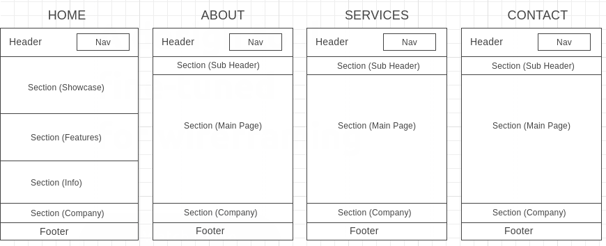

# Development Strategy

> `app-theme`

The project is created to make a responsive layout website using HTML, CSS and Flexboxgrid

## Wireframe

<!-- include a wireframe for your project in this repository, and display it here -->
<!-- wireframe.cc is a good site for getting started with wireframes -->

## 0. Set-Up

__Aa a user, I can see my initial repository and live demo__

### Repo

- Generate from Template
- Write initial, basic README
- Write initial, basic Development Strategy
- Create new file of about.html, services.html, contact.html
- add css files: style.css, font-awesome.css, flexboxgrid.css
- add assets
- Turn on GitHub Pages

## 1. User-story: Header-Footer

__As a user of the site, I want to know the name of the website__

### Repo

1. This user story was developed on a brach called `header-footer`
2. The new branch was pushed to the shared repository
3. A pull request was made to `master` & reviewed by the team
4. Changes were merged to `master`.

### HTML

- A header element with a name of website
- A navigation bar with a name of its function
- A footer

### CSS

- Layout styling for the header, navigation bar, & footer
- Text styling for the name of website, navigation bar, and footer

## 2. User Story: Core-Features

__As a user of the site, I want to know more about website and its services__

1. This user story was developed on a brach called `core-features`
2. The new branch was pushed to the shared repository
3. A pull request was made to `master` & reviewed by the team
4. Changes were merged to `master`.

### HTML

- A section of showcase
- A section of features
- A section of information

### CSS

- Styling for a section of boxes
- Styling for a section of showcase
- Styling for a section of information

## 3. User Story: Company-Info
__As a user of the site, I want to know about the company and subscribe the mailing list__

1. This user story was developed on a brach called `company-info`
2. The new branch was pushed to the shared repository
3. A pull request was made to `master` & reviewed by the team
4. Changes were merged to `master`.

### HTML

A section of company

### CSS

Styling for a section of company

## 4. User Story: About-Page
__As a user of the site, I want to know more about the provider of service and their work__

1. This user story was developed on a brach called `about-page`
2. The new branch was pushed to the shared repository
3. A pull request was made to `master` & reviewed by the team
4. Changes were merged to `master`.

### HTML

- A section of subheader
- Section about 'Who We Are' and 'What We Do'

### CSS

- Styling for section of subheader
- Styling for section about 'Who We Are' and 'What We Do'

## 5. User Story: Services-Page
__As a user of the site, I want to know about the type of services__

1. This user story was developed on a brach called `services-page`
2. The new branch was pushed to the shared repository
3. A pull request was made to `master` & reviewed by the team
4. Changes were merged to `master`.

### HTML

- A section of subheader
- A section about 'What We Offer'

### CSS

- Styling for section of subheader
- Styling for section about 'What We Offer'

## 6. User Story: Contact-Page
__As a user of the site, I want to be able to contact the company__

1. This user story was developed on a brach called `contact-page`
2. The new branch was pushed to the shared repository
3. A pull request was made to `master` & reviewed by the team
4. Changes were merged to `master`.

### HTML

- A section of subheader
- A section about 'Contact Form'

### CSS

- Styling for section of subheader
- Styling for section about 'Contact Form'

## 7. User Story: Responsiveness
__As a user of the site, I want to be make a responsive website__

1. This user story was developed on a brach called `responsiveness`
2. The new branch was pushed to the shared repository
3. A pull request was made to `master` & reviewed by the team
4. Changes were merged to `master`.

### CSS

- Styling using media queries

## 8. User Story: Finishing
__As a user of the site, I want to make everything perfect__

1. This user story was developed on a brach called `finishing-touch`
2. The new branch was pushed to the shared repository
3. A pull request was made to `master` & reviewed by the team
4. Changes were merged to `master`.

### Finishing Touches

- Update development strategy
- Write final, complete README:
  - [makeareadme.com](https://www.makeareadme.com/)
  - [bulldogjob](https://bulldogjob.com/news/449-how-to-write-a-good-readme-for-your-github-project)
  - [meakaakka](https://medium.com/@meakaakka/a-beginners-guide-to-writing-a-kickass-readme-7ac01da88ab3)
- Validate code to check for any last mistakes
